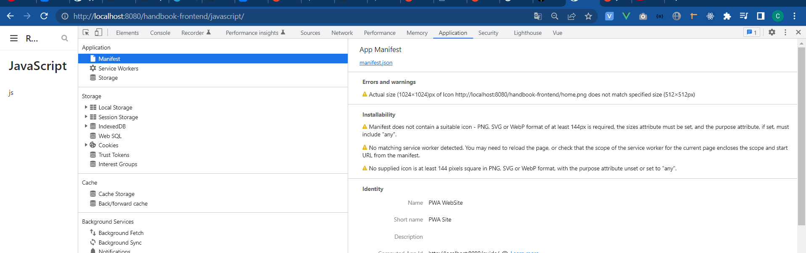

# test
про pwa
https://www.youtube.com/watch?v=ifroMW_F4Sc

редактор svg -
https://devfix.ru/app/editor-svg/
Примеры
test - 2 - deploy
[//]: # (![An image]&#40;./image.png&#41; картинка)

::: v-pre
`{{ This will be displayed as-is }}`
:::

Таблица

| Tables        | Are           | Cool  |
| ------------- |:-------------:| -----:|
| col 3 is      | right-aligned | $1600 |
| col 2 is      | centered      |   $12 |
| zebra stripes | are neat      |    $1 |

## Emoji
https://github.com/markdown-it/markdown-it-emoji/blob/master/lib/data/full.json

[[toc]]

